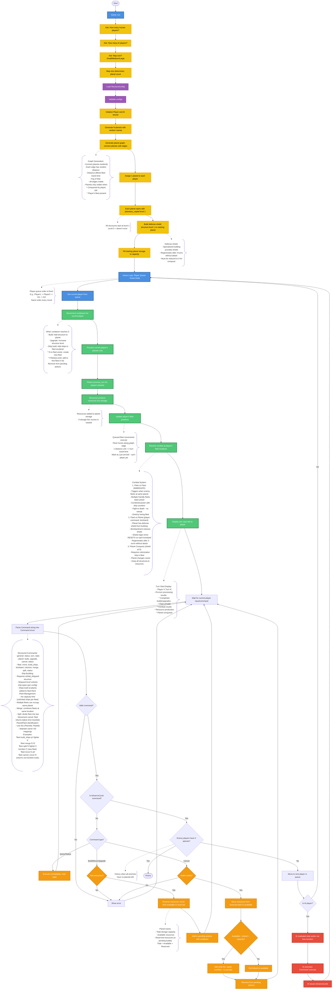

# ColonyProtocol Architecture Flowchart

```mermaid
flowchart TD
    Start([Start]) --> GameRun[Game::run]

    %% Setup Phase
    GameRun --> AskPlayers[Ask: How many human players?]
    AskPlayers --> AskAI[Ask: How many AI players?]
    AskAI --> AskMapSize[Ask: Map size? Small/Medium/Large]
    AskMapSize --> MapToPlanets[Map size determines planet count]

    %% Initialization
    MapToPlanets --> LoadConfigs[Load StructureConfig]
    LoadConfigs --> ValidateConfigs[Validate configs]
    ValidateConfigs --> InitPlayers[Initialize Player and AI structs]
    InitPlayers --> GenPlanets[Generate N planets with random names]
    GenPlanets --> GenGraph[Generate planet graph: connect planets with edges]

    GraphGen@{ shape: braces, label: "Graph Generation:<br/>- Connect planets randomly<br/>- Each edge has random distance<br/>- Distance affects fleet travel time<br/>Fog of War:<br/>- All edges visible<br/>- Planets only visible when:<br/>  * Conquered by player, OR<br/>  * Player's fleet present" }
    GenGraph -.-> GraphGen

    GenGraph --> AssignPlanet[Assign 1 planet to each player]
    AssignPlanet --> BuildCapital[Each planet starts with planetary_capital level 1]

    StructureLevel@{ shape: brace-r, label: "All structures start at level 1<br/>Level 0 = doesn't exist" }
    BuildCapital -.-> StructureLevel

    BuildCapital --> BuildDefense[Build defense shield structure level 1 on starting planet]
    BuildDefense --> FillStorage[Fill starting planet storage to capacity]

    DefenseShield@{ shape: brace-r, label: "Defense shield:<br/>- Specialized building provides shield<br/>- Regenerates after 3 turns without attack<br/>- Must be reduced to 0 for conquest" }
    BuildDefense -.-> DefenseShield

    %% Main game loop
    FillStorage --> GameLoop[Game Loop: Player Queue - Fixed Order]

    PlayerQueue@{ shape: brace-r, label: "Player queue order is fixed:<br/>E.g., Player1 -> Player2 -> AI1 -> AI2<br/>Same order every round" }
    GameLoop -.-> PlayerQueue

    GameLoop --> CurrentPlayer[Get current player from queue]

    %% PRE-TURN PROCESSING - happens at START of player's turn
    CurrentPlayer --> DecrementCooldowns[Decrement cooldowns for current player]

    CooldownComplete@{ shape: braces, label: "When cooldown reaches 0:<br/>- Build: Add structure to planet<br/>- Upgrade: Increase structure level<br/>- Ship build: Add ships to fleet at planet<br/>  * If no fleet exists: create new fleet<br/>  * If fleet(s) exist: add to first fleet in list<br/>Remove from pending actions" }
    DecrementCooldowns -.-> CooldownComplete

    DecrementCooldowns --> ProcessPlayerTurn[Process current player's planets only]
    ProcessPlayerTurn --> PlayerPlanetProcess[Planet::process_turn for player's planets]
    PlayerPlanetProcess --> PlayerProduction[Structures produce resources into storage]

    ProductionNote@{ shape: brace-r, label: "Resources added to planet storage<br/>If storage full, excess is wasted" }
    PlayerProduction -.-> ProductionNote

    PlayerProduction --> ProcessPlayerFleets[Update player's fleet positions]

    FleetMovement@{ shape: brace-r, label: "Queued fleet movements execute<br/>Fleet moves along graph edge<br/>1 distance unit = 1 turn travel time<br/>Mark as 'just arrived' - can't attack yet" }
    ProcessPlayerFleets -.-> FleetMovement

    ProcessPlayerFleets --> ProcessPlayerCombat[Resolve combat at player's fleet locations]

    CombatNote@{ shape: brace-r, label: "Combat System:<br/>1. Fleet vs Fleet (IMMEDIATE)<br/>   - Triggers when enemy fleets at same planet<br/>   - Multiple friendly fleets stack power<br/>   - Combined power with ship counters<br/>   - Fight to death - no retreat<br/>   - Destroy losing fleet<br/>2. Fleet vs Planet (player command: bombard)<br/>   - Planet has defense shield from building<br/>   - Bombardment reduces shield<br/>   - Shield regen timer RESETS on each bombard<br/>   - Regenerates after 3 turns without attack<br/>3. Planet Conquest (shield at 0):<br/>   - Requires colonization ship in fleet<br/>   - Planet changes owner<br/>   - Keep all structures & resources" }
    ProcessPlayerCombat -.-> CombatNote

    ProcessPlayerCombat --> ShowTurnStart[Display turn start info to player]

    TurnDisplay@{ shape: brace-r, label: "Turn Start Display:<br/>- 'Player X Turn N'<br/>- Pre-turn processing results:<br/>  * Completed builds/upgrades<br/>  * Fleet arrivals<br/>  * Combat results<br/>  * Resource production<br/>  * Planet conquests" }
    ShowTurnStart -.-> TurnDisplay

    %% Command phase - player can now react to what happened
    ShowTurnStart --> UserInput[Wait for current player input/command]

    %% Command processing
    UserInput --> CommandParser[Parse Command string into Command enum]

    CommandStructure@{ shape: braces, label: "Structured Commands:<br/>- general: status, turn, stats<br/>- planet: build, upgrade, cancel, status<br/>- fleet: move, build_ships, bombard, colonize, merge, split, status<br/>Ship Building:<br/>- Requires orbital_shipyard structure<br/>- Shipyard level unlocks ship types (per config)<br/>- Ships build at planet, added to fleet there<br/>Fleet Management:<br/>- No capacity limit (unlimited ships per fleet)<br/>- Multiple fleets can occupy same planet<br/>- Merge: combines fleets at same location<br/>- Split: divide fleet into two<br/>- Movement cancel: fleet returns (takes time traveled)<br/>Planet/Fleet identification:<br/>- Use IDs (PlanetId, FleetId)<br/>- Maintain name->ID mappings<br/>Examples:<br/> 'fleet build_ships p1 fighter 5'<br/> 'fleet merge f1 f2'<br/> 'fleet split f1 fighter:3 bomber:2' (new fleet)<br/> 'fleet move f1 p5'<br/> 'fleet cancel_move f1' (returns via traveled route)" }
    CommandParser -.-> CommandStructure

    CommandParser --> ValidateCmd{Valid command?}
    ValidateCmd -->|No| ShowError[Show error]
    ShowError --> UserInput

    ValidateCmd -->|Yes| CheckEndTurn{Is AdvanceCycle command?}

    %% Regular commands
    CheckEndTurn -->|No| CheckCommandType{Command type?}

    %% Immediate commands - no cooldown, execute right away
    CheckCommandType -->|Query/Status| ExecuteImmediate[Execute immediately, read state]
    ExecuteImmediate --> UserInput

    %% Queued commands - have cooldown, reserve resources
    CheckCommandType -->|Build/Move/Upgrade| CheckResources{Has resources?}
    CheckResources -->|No| ShowError
    CheckResources -->|Yes| ReserveResources[Reserve resources: move from available to reserved]

    ResourceTracking@{ shape: brace-r, label: "Planet tracks:<br/>- Total storage capacity<br/>- Available resources<br/>- Reserved resources (in pending builds)<br/>Total = Available + Reserved" }
    ReserveResources -.-> ResourceTracking

    ReserveResources --> QueueAction[Add to pending actions with cooldown]
    QueueAction --> UserInput

    %% Cancel command - refund resources
    CheckCommandType -->|Cancel| FindAction{Action exists?}
    FindAction -->|No| ShowError
    FindAction -->|Yes| RefundResources[Move resources from reserved back to available]
    RefundResources --> CheckStorage{Available + refund > capacity?}
    CheckStorage -->|Yes| WasteOverflow[Add what fits, waste overflow - no penalty]
    CheckStorage -->|No| FullRefund[Full refund to available]
    WasteOverflow --> RemoveAction[Remove from pending actions]
    FullRefund --> RemoveAction
    RemoveAction --> UserInput

    %% AdvanceCycle - end turn, move to next player
    CheckEndTurn -->|Yes| CheckVictory{Enemy players have 0 planets?}

    VictoryCondition@{ shape: brace-r, label: "Victory when all enemies<br/>have no planets left" }
    CheckVictory -.-> VictoryCondition

    CheckVictory -->|Yes| End([Victory])
    CheckVictory -->|No| NextPlayer[Move to next player in queue]
    NextPlayer --> CheckAI{Is AI player?}
    CheckAI -->|No| GameLoop
    CheckAI -->|Yes| AIDecision[AI evaluates best action via loss function]
    AIDecision --> AIExecute[AI executes Command::execute]
    AIExecute --> AIEndTurn[AI issues AdvanceCycle]
    AIEndTurn --> GameLoop

    %% Styling - highlight important nodes
    classDef setupNodes fill:#f1c40f,stroke:#f39c12,stroke-width:2px,color:#000
    classDef configNodes fill:#9b59b6,stroke:#7d3c98,stroke-width:2px,color:#fff
    classDef coreSystem fill:#4a90e2,stroke:#2e5c8a,stroke-width:3px,color:#fff
    classDef turnProcess fill:#50c878,stroke:#2d7a4a,stroke-width:3px,color:#fff
    classDef commandFlow fill:#f39c12,stroke:#c87f0a,stroke-width:2px,color:#fff
    classDef aiNodes fill:#e74c3c,stroke:#c0392b,stroke-width:3px,color:#fff

    class GameRun,GameLoop,CurrentPlayer coreSystem
    class AskPlayers,AskAI,AskMapSize,MapToPlanets,InitPlayers,BuildCapital,BuildDefense,FillStorage,GenPlanets,GenGraph,AssignPlanet setupNodes
    class LoadConfigs,ValidateConfigs configNodes
    class DecrementCooldowns,ProcessPlayerTurn,PlayerPlanetProcess,PlayerProduction,ProcessPlayerFleets,ProcessPlayerCombat,ShowTurnStart turnProcess
    class ExecuteImmediate,CheckResources,ReserveResources,QueueAction,FindAction,RefundResources,CheckStorage,WasteOverflow,FullRefund,RemoveAction commandFlow
    class AIDecision,AIExecute,AIEndTurn aiNodes
```
